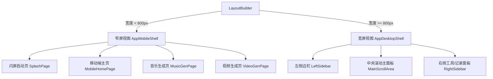

# 轻青 UI 重构设计规范 (Design Spec)

## 一、 项目背景与重构范围

轻青 (QingQing) 项目是一个集成多模态創作能力的工具，支持音乐生成、图片生成、视频生成等，全站已经重构为单一多模态工作台。原有的 Flutter 客户端较为简陋，仅提供了基础的登录页、设置页与通用 Agent 创作页。
本次重构的目标是**严格复刻**用户提供的两张参考图，重构轻青的 UI 界面，且**不改动后端逻辑**。

重构包含两个核心形态，它们将在 Flutter 前端代码中实现**自适应响应式布局**：
1. **窄屏视图 (Mobile, 宽度 < 800px)**：严格复刻参考图 1，包含启动页、控制台首页、音乐生成页、视频生成页，以及底部导航栏。
2. **宽屏视图 (Desktop/Web, 宽度 >= 800px)**：严格复刻参考图 2，包含左侧导航栏、顶栏、主 Banner 区域、热门工具区、灵感社区和我的作品，以及右侧侧边栏（包含创作工具箱、最近使用、每日灵感名言）。

---

## 二、 视觉与色彩规范

为了呈现极具品质感、呼吸感的现代 UI，我们将严格采用参考图中的美学方案：
*   **主色调**：
    *   轻青渐变绿：`#2CD9C5`
    *   轻青渐变蓝：`#2CB3FF`
    *   高亮渐变：由浅绿/浅青到浅蓝的线性渐变（用于主按钮和卡片装饰）
    *   音乐主题色：淡绿色系（背景 `#E8F8F5`，图标/文字 `#16A085`）
    *   图片主题色：淡蓝色系（背景 `#EBF5FB`，图标/文字 `#2980B9`）
    *   视频主题色：淡橙色系（背景 `#FEF9E7`，图标/文字 `#D35400`）
*   **背景与底色**：
    *   主底色：极浅灰色 `#F7F9FC`
    *   卡片底色：纯白 `#FFFFFF`，配以极细灰色描边 `#EBF0F6` 以及超柔和阴影（`BoxShadow`，模糊半径 15，颜色不透明度 0.04）
*   **字体与排版**：
    *   主标题（如“你好，创作者”）：粗体字（`FontWeight.w700`），字号 26-28
    *   副标题/标签：中黑（`FontWeight.w500`），字号 14-16
    *   正文与说明字：常规体（`FontWeight.w400`），字号 12-13，颜色为中灰/暗灰 `#5F6C7D`
    *   使用现代字体（如 `Inter` 或系统默认免授权精美无衬线字）

---

## 三、 响应式布局架构 (Responsive Architecture)

在 `lib/src/qingqing_app.dart` 中，将通过 `LayoutBuilder` 判断窗口宽度：

*   **状态共享**：所有的路由切换与页面展示均基于原有的 `AppController`，登录状态由其托管。
*   **无缝对接**：当检测到未登录状态时，窄屏显示全屏 `LoginPage`；宽屏展示高颜值的登录卡片。

---

## 四、 页面级复刻剖析

### 1. 移动端启动页 (SplashPage)
*   **主视觉**：白底，中间有轻青绿叶图标（绿蓝渐变 + 小闪光星），下面显示“轻青”大字及“AI 创作，灵感成真”。
*   **插图**：底部配以水墨风格的绿色/蓝色渐变山峦，以及一艘简约的小白船，充满诗意与灵动。
*   **底部元素**：展示小字“一站式 AI 创作平台\n音乐 · 图片 · 视频”，以及一个醒目的蓝绿渐变圆角主按钮“开启创作之旅”。
*   **交互**：点击“开启创作之旅”后，若已登录进入首页，未登录则滑入登录界面。

### 2. 移动端主页 (MobileHomePage) & 底部导航栏
*   **头部**：左上角是项目名“轻青”及欢迎语“Hi，今天想创作什么呢？”，右上角是一个小巧精致的“会员中心”绿色小药丸按钮。
*   **功能入口**：水平排布的三个大圆角卡片，带有相应的图标和背景渐变色，分别对应“音乐生成”、“图片生成”、“视频生成”。
*   **灵感社区**：横向滚动卡片，展示公开的生成效果（包含封面、类别标签如“音乐”、“图片”、播放量等）。
*   **我的创作**：纵向列表展示当前用户的历史 Run 或产物（带有播放按钮或选项菜单）。
*   **底部导航栏**：
    *   图标选项：首页（选中）、灵感、[+]（大按钮）、作品、我的。
    *   点击 `[+]` 按钮可以快速拉起原先的 `AgentPage` 进行全能创作。

### 3. 生成详情页 (MusicGenPage & VideoGenPage)
*   **音乐生成页**：
    *   文本域：供用户输入提示词（右下角指示字数限制，如 `0/200`）。
    *   配置标签行：风格选择（流行、电子、古典等）、情绪选择（快乐、放松、悲伤等）、时长（15s, 30s等）、生成数量。选中的标签呈现绿字绿边框并带淡绿背景。
    *   底部动作：渐变圆角大按钮 `+ 生成音乐`，下方带有说明文本 `消耗 1 积分`。
*   **视频生成页**：
    *   风格标签：带有配图的圆角卡片（写实、动漫、赛博朋克等），选中卡片呈现淡绿色边框。
    *   比例选择：16:9, 9:16, 1:1, 4:3, 3:4。
    *   时长选择与生成数量。
    *   底部动作：渐变圆角大按钮 `+ 生成视频`，下方说明文本 `消耗 2 积分`。

### 4. 桌面端工作台 (DesktopDashboard)
*   **左侧导航栏**：以侧边抽屉式呈现，顶部为“轻青”Logo。导航项为：首页、音乐生成、图片生成、视频生成；灵感社区、我的作品、收藏夹、使用记录。左下角为“轻青Pro/升级”推广卡片，最下方为当前用户头像、昵称（“轻风 普通用户”）以及退出登录等选项。
*   **顶部搜索与功能区**：包含一个带 `⌘K` 视觉引导的精美搜索栏、会员中心按钮、消息通知铃铛、用户头像。
*   **中心大 Banner**：流光质感渐变背景卡片，主文案“你好，创作者”，副文案“用 AI 激发灵感，创造无限可能”，下方排布四个小型快捷跳转卡片。
*   **中间工作区**：
    *   热门工具：展示三个横向的大卡片（音乐、图片、视频生成），点击“开始创作 ->”直接切换到对应面板。
    *   社区与作品：以多栏网格布局展示社区精选作品，以及“我的作品”历史列表。
*   **右侧工具/历史栏**：
    *   创作工具箱：快捷小图标（智能配乐、歌词生成、风格迁移等）。
    *   最近使用：展示最近生成的 runs 列表。
    *   今日创作灵感：极富诗意的话语。

---

## 五、 后端 API 对接逻辑

本次重构**绝不改动后端逻辑**，所有的交互都基于现有的 API 进行封装：
1.  **登录对接**：
    *   `POST /api/v1/auth/email/request-code` 请求验证码。
    *   `POST /api/v1/auth/email/verify` 获取 Token。
2.  **首页与作品列表**：
    *   我的创作列表直接调 `GET /api/v1/agent/runs` 获取，如果是宽屏视图，可点击左侧“我的作品”加载详情。
3.  **音乐与视频生成**：
    *   用户在界面选择完风格、时长、情绪等参数后，系统会将这些选项拼接为提示词 Goal（例如：生成一首包含 [流行] 风格、[快乐] 情绪的音乐，时长为 [30s]）。
    *   并发起 `POST /api/v1/agent/runs` 请求，`routing` 中 `capability` 对应 `music` 或 `video`。
    *   若返回状态为 `awaiting_approval`，则展示费用预览，用户确认后调 `POST /api/v1/agent/runs/{id}/execute` 执行，并轮询该任务状态。
4.  **权益信息展示**：
    *   调 `GET /api/v1/me/entitlements` 获取当前用户的月度额度限制及并发数。若用户为普通用户，则在侧边栏显示“轻青Pro，解锁更多生成权益 立即升级”；若是 VIP 或者是 local-user 拥有全部权益，则进行相应显示。

---

## 六、 新鲜视觉验证计划

1.  **编译与热重载验证**：使用 `puro` 确保项目编译成功。
2.  **分辨率自适应验证**：在调试模式下拖拽窗口大小，验证在宽度临界值 800px 时，界面能够在窄屏移动端与宽屏桌面端之间平滑过渡，无任何布局溢出。
3.  **主要交互流验证**：
    *   非登录状态下，必须看到精美的启动页；点击“开启创作之旅”后，应显示登录页。
    *   登录后，窄屏下能够通过底部导航栏顺利切换页面，在生成页能够配置属性并点击生成。
    *   宽屏下能顺畅通过左侧导航栏、热门工具卡片快速切换到对应的生成面板。
